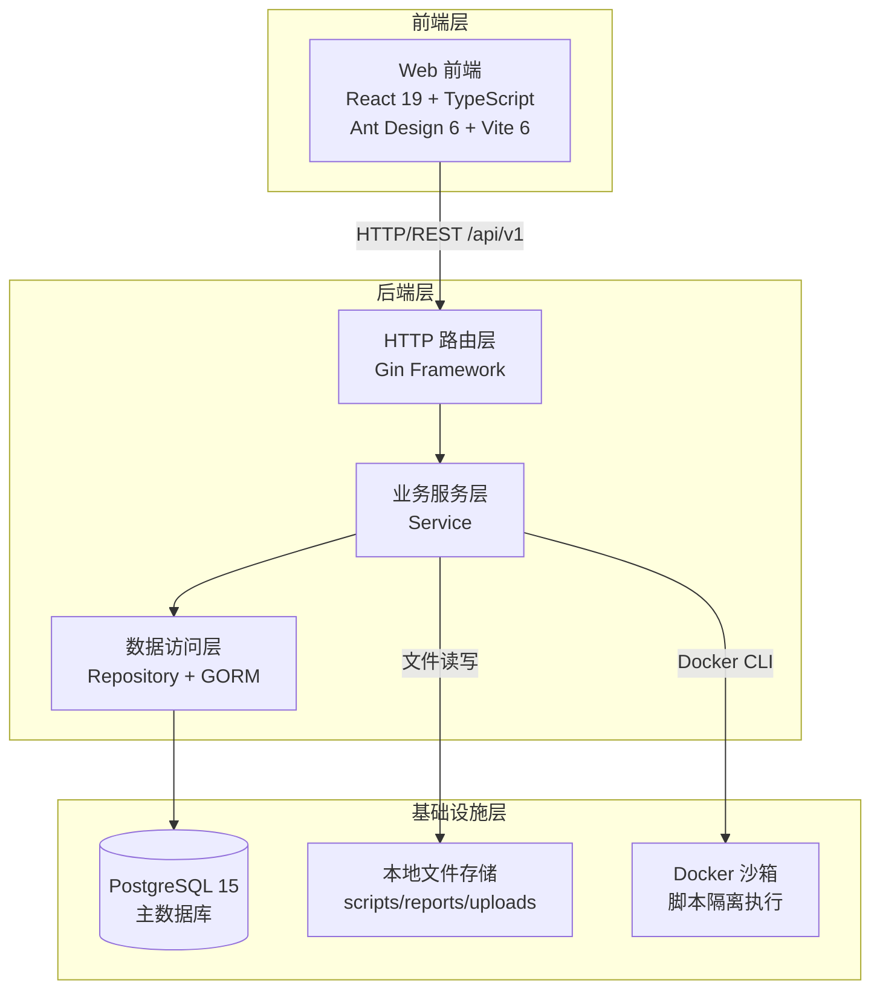
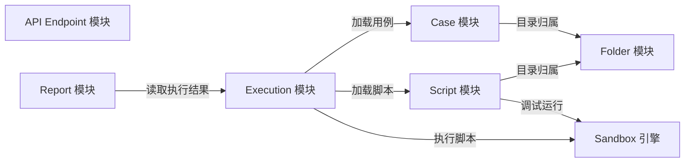
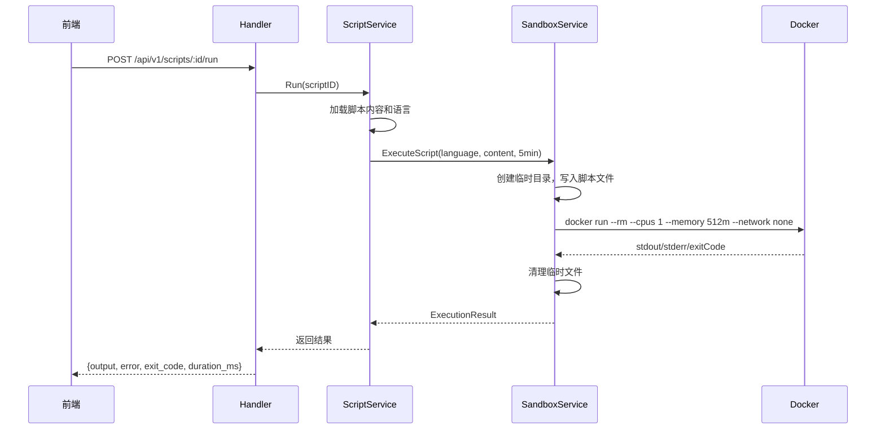
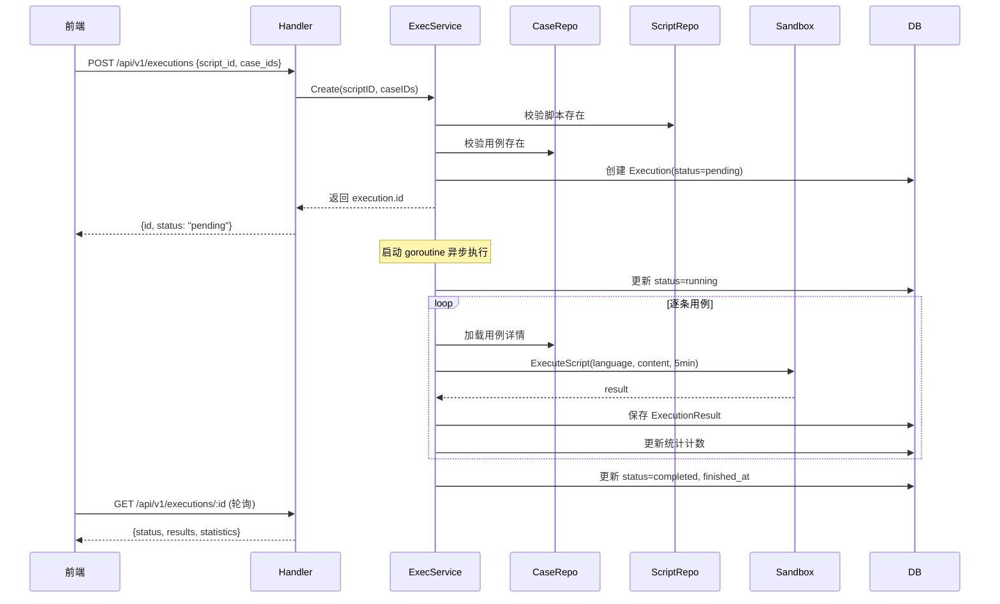
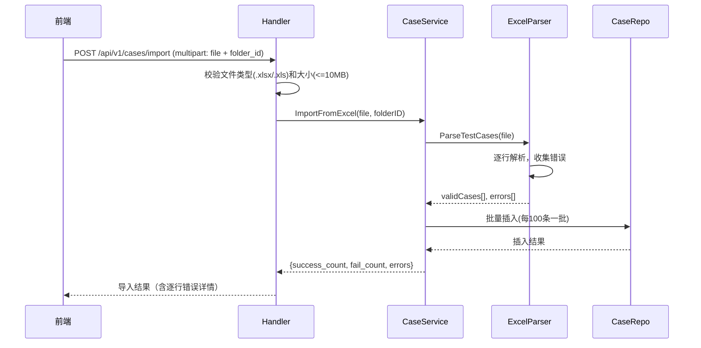
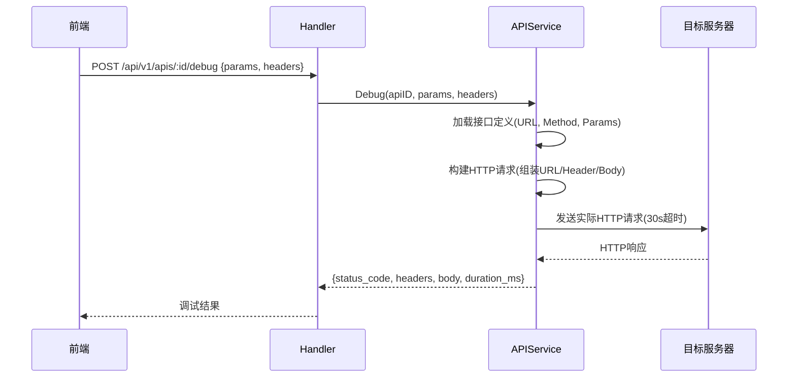
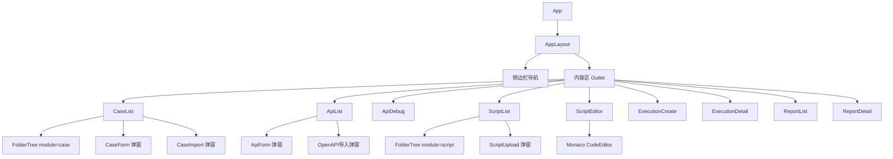

# 架构设计文档（补充）

> 本文档基于现有实现，补充系统整体架构图、模块划分、核心流程设计等内容。详细的数据库定义和接口协议请参阅 [详细规格文档](./specs.md)。

## 1. 架构概述

### 1.1 系统架构图

### 1.2 架构说明

本系统采用**前后端分离 + 分层架构**模式：

1. **架构模式**：单体应用 + 三层分层（Handler -> Service -> Repository）
2. **前端**：React SPA，通过 Vite 开发代理将 `/api` 请求转发到后端 8080 端口
3. **后端**：Go/Gin 提供 RESTful API，采用依赖注入组装各层
4. **数据流向**：
   - 读路径：前端 -> Gin Handler -> Service -> Repository -> PostgreSQL -> 逐层返回
   - 写路径：前端 -> Gin Handler（参数校验）-> Service（业务逻辑）-> Repository（持久化）
   - 文件路径：脚本/报告通过 Service 层直接操作本地文件系统
   - 执行路径：Service 层通过 Docker CLI 调用容器执行脚本

## 2. 后端模块划分

### 2.1 模块总览

| 模块名称 | 职责 | 核心功能 | 依赖模块 |
|---------|------|---------|---------|
| Folder | 目录管理 | 树形目录CRUD、级联删除 | - |
| Case | 测试用例管理 | 用例CRUD、Excel导入导出 | Folder |
| API Endpoint | 测试接口管理 | 接口CRUD、OpenAPI导入、在线调试 | - |
| Script | 测试脚本管理 | 脚本上传/编辑、在线调试运行 | Folder, Sandbox |
| Execution | 自动化执行 | 创建执行任务、异步批量执行 | Case, Script, Sandbox |
| Report | 测试报告 | 报告生成(PDF/Excel)、下载 | Execution |
| Sandbox | 沙箱执行引擎 | Docker容器管理、脚本隔离执行 | - |

### 2.2 模块交互图

### 2.3 各模块详细说明

**模块：Sandbox（沙箱执行引擎）**
- 职责描述：提供安全隔离的脚本执行环境
- 提供的服务：`ExecuteScript(language, content, timeout) -> ExecutionResult`
- 依赖的服务：Docker CLI、本地文件系统（临时文件）
- 关键文件：`server/internal/service/sandbox.go`
- 设计要点：
  - 每次执行创建临时目录，写入脚本后挂载到容器
  - 容器资源限制：1核CPU、512MB内存、无网络、禁止提权
  - Go 使用 `golang:1.22-alpine`，Python 使用 `python:3.12-slim`
  - 超时通过 `context.WithTimeout` + Docker 容器自动清理实现
  - 执行完毕后清理临时文件（`defer os.RemoveAll`）

**模块：Execution（自动化执行）**
- 职责描述：编排测试用例的批量执行流程
- 提供的服务：创建执行任务、查询执行状态和结果
- 依赖的服务：Case Repository、Script Repository、Sandbox Service
- 关键文件：`server/internal/service/execution.go`, `server/internal/handler/execution.go`
- 设计要点：
  - 异步执行：通过 goroutine 在后台逐条执行用例
  - 状态机：pending -> running -> completed/failed
  - 每条用例独立超时（5分钟），超时不影响后续用例执行
  - 前端通过轮询 GET 接口获取实时进度

## 3. 核心流程设计

### 3.1 流程：脚本在线调试

**流程描述**：用户在代码编辑器中修改脚本后点击"调试运行"，系统在 Docker 沙箱中执行脚本并返回输出。

**异常分支处理：**
- 脚本执行超时（5分钟）：context 取消，Docker 容器被终止，返回 timedOut=true
- Docker 镜像不存在：自动拉取（5分钟超时），拉取失败返回错误
- 不支持的语言：直接返回错误，不创建容器

### 3.2 流程：自动化批量执行

**流程描述**：用户选择脚本和用例后创建执行任务，系统异步逐条执行并记录结果。

### 3.3 流程：Excel 批量导入用例

### 3.4 流程：接口在线调试

## 4. 前端设计

### 4.1 页面/路由结构

| 路由 | 页面组件 | 功能描述 | 加载方式 |
|------|---------|---------|---------|
| `/` | - | 重定向到 `/cases` | - |
| `/cases` | CaseList | 测试用例列表（含目录树） | 懒加载 |
| `/apis` | ApiList | 测试接口列表 | 懒加载 |
| `/apis/:id/debug` | ApiDebug | 接口在线调试 | 懒加载 |
| `/scripts` | ScriptList | 测试脚本列表（含目录树） | 懒加载 |
| `/scripts/:id/edit` | ScriptEditor | 脚本在线编辑+调试 | 懒加载 |
| `/execution` | ExecutionCreate | 创建执行任务 | 懒加载 |
| `/execution/:id` | ExecutionDetail | 执行详情+结果 | 懒加载 |
| `/reports` | ReportList | 测试报告列表 | 懒加载 |
| `/reports/:id` | ReportDetail | 报告详情+下载 | 懒加载 |

### 4.2 组件树

### 4.3 状态管理（Zustand）

系统使用 5 个独立的 Zustand Store，各自管理对应模块的状态：

| Store | 核心状态 | 核心方法 |
|-------|---------|---------|
| folderStore | caseFolders, scriptFolders, loading | loadCaseFolders, loadScriptFolders, createFolder, renameFolder, deleteFolder |
| caseStore | cases, total, currentPage, selectedFolderId | loadCases, createCase, updateCase, deleteCase, importExcel |
| apiStore | apis, total, keyword | loadAPIs, createAPI, updateAPI, deleteAPI, importOpenAPI |
| scriptStore | scripts, currentScript, selectedFolderId | loadScripts, uploadScript, updateScript, deleteScript, runScript |
| executionStore | executions, currentExecution | loadExecutions, loadExecutionById, createExecution |

## 5. 技术选型

| 层级 | 技术 | 版本 | 选型理由 |
|------|------|------|---------|
| 前端框架 | React + TypeScript | 19.x | 生态成熟，类型安全 |
| UI 组件库 | Ant Design | 6.x | 企业级组件丰富，表格/表单/树形控件完善 |
| 构建工具 | Vite | 6.x | 开发热更新快，构建速度优 |
| 状态管理 | Zustand | 5.x | 轻量、无样板代码、支持异步 |
| HTTP 客户端 | Axios | 1.x | 拦截器机制成熟，错误处理方便 |
| 代码编辑器 | Monaco Editor | 4.x (@monaco-editor/react) | VS Code 同款引擎，语法高亮完善 |
| 路由 | React Router | 7.x | 标准路由方案，支持懒加载 |
| 后端语言 | Go | 1.22 | 高性能、并发友好、编译型 |
| Web 框架 | Gin | 1.10 | 高性能HTTP框架，中间件生态丰富 |
| ORM | GORM | 2.x | Go 生态最流行ORM，支持迁移和关联 |
| 数据库 | PostgreSQL | 15 | 功能强大、支持JSON、事务可靠 |
| Excel 处理 | excelize | 2.8 | Go 原生Excel读写，支持样式 |
| PDF 生成 | gofpdf | 1.16 | 轻量PDF生成库 |
| 脚本沙箱 | Docker CLI | 24+ | 成熟的容器隔离方案，资源限制完善 |

## 6. 安全设计

- **认证方式**：AuthRequired 中间件（当前实现为占位，预留 JWT/Token 扩展点）
- **脚本沙箱隔离**：
  - Docker 容器：`--cpus 1 --memory 512m --network none`
  - 安全选项：`--security-opt no-new-privileges --cap-drop ALL --user nobody:nogroup`
  - 文件系统：脚本目录只读挂载（`:ro`）
- **接口调试代理**：所有调试请求通过后端代理发出，前端不直接发起跨域请求
- **文件上传校验**：后缀白名单 + 大小限制（10MB）
- **输入校验**：参数名正则 `^[a-zA-Z_][a-zA-Z0-9_]*$`
- **SQL 注入防护**：GORM 参数化查询
- **CORS**：中间件控制跨域策略
- **软删除**：所有核心表使用 GORM DeletedAt 软删除，数据可恢复

## 7. 性能考量

- **数据库索引**：所有外键字段（folder_id, api_id, execution_id）和查询字段（module, status）建立索引
- **分页查询**：所有列表接口默认 20 条/页，避免全表扫描
- **批量操作**：Excel 导入每 100 条一批插入，减少数据库往返
- **前端懒加载**：所有页面 React.lazy + Suspense 按需加载
- **开发代理**：Vite 代理避免 CORS 预检请求开销
- **异步执行**：自动化执行在 goroutine 中异步进行，不阻塞 HTTP 响应
- **轮询策略**：执行详情页 3 秒轮询，脚本调试 1 秒轮询（最多 30 次）

## 8. 文档索引

- 产品需求文档：`./product.md`
- 原始技术设计：`./design.md`
- 详细数据库设计 & 接口协议：`./specs.md`
- 后端开发总结：`./develop/backend.md`
- 前端开发总结：`./develop/front.md`

