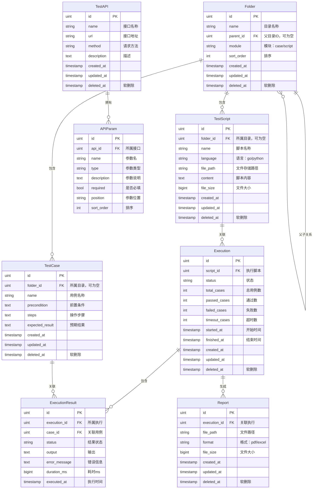

# 详细规格文档

> 本文档包含数据库设计和接口协议的完整定义，是编码实现的直接参考。架构背景请参阅 [架构设计文档](./design-supplement.md)。

## 1. 数据库设计

### 1.1 实体关系图 (ER 图)



### 1.2 数据表详细定义

**表名**：`folders`
**表说明**：目录表，用例和脚本共用，通过 module 字段区分。支持无限层级嵌套。

| 字段名 | 类型 | 是否必填 | 默认值 | 约束 | 含义 |
|--------|------|---------|--------|------|------|
| id | BIGSERIAL | 是 | 自增 | PRIMARY KEY | 目录唯一标识 |
| name | VARCHAR(255) | 是 | - | NOT NULL | 目录名称 |
| parent_id | BIGINT | 否 | NULL | FK -> folders(id) ON DELETE CASCADE | 父目录ID |
| module | VARCHAR(20) | 是 | - | NOT NULL, CHECK IN ('case','script') | 所属模块 |
| sort_order | INT | 否 | 0 | - | 排序权重 |
| created_at | TIMESTAMPTZ | 是 | NOW() | NOT NULL | 创建时间 |
| updated_at | TIMESTAMPTZ | 是 | NOW() | NOT NULL | 更新时间 |
| deleted_at | TIMESTAMPTZ | 否 | NULL | INDEX | 软删除标记 |

**索引设计：**
- `idx_folders_parent_id` ON `folders(parent_id)` -- 树形查询优化
- `idx_folders_module` ON `folders(module)` -- 模块筛选优化
- `idx_folders_deleted_at` ON `folders(deleted_at)` -- 软删除查询

---

**表名**：`test_cases`
**表说明**：测试用例表，存储用例的基本信息。

| 字段名 | 类型 | 是否必填 | 默认值 | 约束 | 含义 |
|--------|------|---------|--------|------|------|
| id | BIGSERIAL | 是 | 自增 | PRIMARY KEY | 用例唯一标识 |
| folder_id | BIGINT | 否 | NULL | FK -> folders(id) ON DELETE SET NULL | 所属目录 |
| name | VARCHAR(255) | 是 | - | NOT NULL | 用例名称 |
| precondition | TEXT | 否 | '' | - | 前置条件 |
| steps | TEXT | 是 | - | NOT NULL | 操作步骤 |
| expected_result | TEXT | 是 | - | NOT NULL | 预期结果 |
| created_at | TIMESTAMPTZ | 是 | NOW() | NOT NULL | 创建时间 |
| updated_at | TIMESTAMPTZ | 是 | NOW() | NOT NULL | 更新时间 |
| deleted_at | TIMESTAMPTZ | 否 | NULL | INDEX | 软删除标记 |

**索引设计：**
- `idx_test_cases_folder_id` ON `test_cases(folder_id)` -- 目录筛选

---

**表名**：`test_apis`
**表说明**：测试接口表，存储接口基本信息。

| 字段名 | 类型 | 是否必填 | 默认值 | 约束 | 含义 |
|--------|------|---------|--------|------|------|
| id | BIGSERIAL | 是 | 自增 | PRIMARY KEY | 接口唯一标识 |
| name | VARCHAR(500) | 是 | - | NOT NULL | 接口名称 |
| url | VARCHAR(2048) | 是 | - | NOT NULL | 接口地址 |
| method | VARCHAR(10) | 是 | 'GET' | NOT NULL | 请求方法 |
| description | TEXT | 否 | '' | - | 接口描述 |
| created_at | TIMESTAMPTZ | 是 | NOW() | NOT NULL | 创建时间 |
| updated_at | TIMESTAMPTZ | 是 | NOW() | NOT NULL | 更新时间 |
| deleted_at | TIMESTAMPTZ | 否 | NULL | INDEX | 软删除标记 |

---

**表名**：`api_params`
**表说明**：接口参数表，与 test_apis 一对多关系。

| 字段名 | 类型 | 是否必填 | 默认值 | 约束 | 含义 |
|--------|------|---------|--------|------|------|
| id | BIGSERIAL | 是 | 自增 | PRIMARY KEY | 参数唯一标识 |
| api_id | BIGINT | 是 | - | NOT NULL, FK -> test_apis(id) ON DELETE CASCADE | 所属接口 |
| name | VARCHAR(255) | 是 | - | NOT NULL, 正则校验 | 参数名称 |
| type | VARCHAR(50) | 是 | - | NOT NULL, CHECK IN (11种类型) | 参数类型 |
| description | TEXT | 否 | '' | - | 参数说明 |
| required | BOOLEAN | 否 | false | - | 是否必填 |
| position | VARCHAR(20) | 是 | - | NOT NULL, CHECK IN ('body','header') | 参数位置 |
| sort_order | INT | 否 | 0 | - | 排序权重 |

**参数类型枚举**：string, bool, int, long, float, object, array\<string\>, array\<int\>, array\<long\>, array\<float\>, array\<object\>

**索引设计：**
- `idx_api_params_api_id` ON `api_params(api_id)` -- 接口关联查询

---

**表名**：`test_scripts`
**表说明**：测试脚本表，存储脚本元信息和内容。

| 字段名 | 类型 | 是否必填 | 默认值 | 约束 | 含义 |
|--------|------|---------|--------|------|------|
| id | BIGSERIAL | 是 | 自增 | PRIMARY KEY | 脚本唯一标识 |
| folder_id | BIGINT | 否 | NULL | FK -> folders(id) ON DELETE SET NULL | 所属目录 |
| name | VARCHAR(500) | 是 | - | NOT NULL | 脚本文件名 |
| language | VARCHAR(20) | 是 | - | NOT NULL, CHECK IN ('go','python') | 脚本语言 |
| file_path | VARCHAR(1024) | 是 | - | NOT NULL | 文件存储路径 |
| content | TEXT | 否 | '' | - | 脚本内容（冗余存储） |
| file_size | BIGINT | 否 | 0 | - | 文件大小(bytes) |
| created_at | TIMESTAMPTZ | 是 | NOW() | NOT NULL | 创建时间 |
| updated_at | TIMESTAMPTZ | 是 | NOW() | NOT NULL | 更新时间 |
| deleted_at | TIMESTAMPTZ | 否 | NULL | INDEX | 软删除标记 |

**索引设计：**
- `idx_test_scripts_folder_id` ON `test_scripts(folder_id)` -- 目录筛选

---

**表名**：`executions`
**表说明**：执行记录表，记录每次自动化执行任务的状态和统计。

| 字段名 | 类型 | 是否必填 | 默认值 | 约束 | 含义 |
|--------|------|---------|--------|------|------|
| id | BIGSERIAL | 是 | 自增 | PRIMARY KEY | 执行唯一标识 |
| script_id | BIGINT | 是 | - | NOT NULL, FK -> test_scripts(id) | 执行脚本 |
| status | VARCHAR(20) | 是 | 'pending' | NOT NULL, CHECK IN ('pending','running','completed','failed') | 执行状态 |
| total_cases | INT | 否 | 0 | - | 总用例数 |
| passed_cases | INT | 否 | 0 | - | 通过数 |
| failed_cases | INT | 否 | 0 | - | 失败数 |
| timeout_cases | INT | 否 | 0 | - | 超时数 |
| started_at | TIMESTAMPTZ | 否 | NULL | - | 开始时间 |
| finished_at | TIMESTAMPTZ | 否 | NULL | - | 结束时间 |
| created_at | TIMESTAMPTZ | 是 | NOW() | NOT NULL | 创建时间 |
| updated_at | TIMESTAMPTZ | 是 | NOW() | NOT NULL | 更新时间 |
| deleted_at | TIMESTAMPTZ | 否 | NULL | INDEX | 软删除标记 |

---

**表名**：`execution_results`
**表说明**：执行结果明细表，记录每条用例的执行结果。

| 字段名 | 类型 | 是否必填 | 默认值 | 约束 | 含义 |
|--------|------|---------|--------|------|------|
| id | BIGSERIAL | 是 | 自增 | PRIMARY KEY | 结果唯一标识 |
| execution_id | BIGINT | 是 | - | NOT NULL, FK -> executions(id) ON DELETE CASCADE | 所属执行 |
| case_id | BIGINT | 是 | - | NOT NULL, FK -> test_cases(id) | 关联用例 |
| status | VARCHAR(20) | 是 | - | NOT NULL, CHECK IN ('passed','failed','timeout','error') | 结果状态 |
| output | TEXT | 否 | '' | - | 标准输出 |
| error_message | TEXT | 否 | '' | - | 错误信息 |
| duration_ms | BIGINT | 否 | 0 | - | 执行耗时(ms) |
| executed_at | TIMESTAMPTZ | 是 | NOW() | NOT NULL | 执行时间 |

**索引设计：**
- `idx_execution_results_execution_id` ON `execution_results(execution_id)` -- 执行关联查询

---

**表名**：`reports`
**表说明**：测试报告表，记录生成的报告文件信息。

| 字段名 | 类型 | 是否必填 | 默认值 | 约束 | 含义 |
|--------|------|---------|--------|------|------|
| id | BIGSERIAL | 是 | 自增 | PRIMARY KEY | 报告唯一标识 |
| execution_id | BIGINT | 是 | - | NOT NULL, FK -> executions(id) | 关联执行 |
| file_path | VARCHAR(1024) | 是 | - | NOT NULL | 报告文件路径 |
| format | VARCHAR(10) | 是 | 'pdf' | NOT NULL, CHECK IN ('pdf','excel') | 报告格式 |
| file_size | BIGINT | 否 | 0 | - | 文件大小(bytes) |
| created_at | TIMESTAMPTZ | 是 | NOW() | NOT NULL | 创建时间 |
| updated_at | TIMESTAMPTZ | 是 | NOW() | NOT NULL | 更新时间 |
| deleted_at | TIMESTAMPTZ | 否 | NULL | INDEX | 软删除标记 |

**索引设计：**
- `idx_reports_execution_id` ON `reports(execution_id)` -- 执行关联查询

### 1.3 数据表关系总结

| 关系 | 类型 | 说明 |
|------|------|------|
| folders -> folders | 自关联一对多 | 父子目录嵌套 |
| folders -> test_cases | 一对多 | 目录包含用例 |
| folders -> test_scripts | 一对多 | 目录包含脚本 |
| test_apis -> api_params | 一对多 | 接口拥有多个参数 |
| test_scripts -> executions | 一对多 | 脚本关联多次执行 |
| executions -> execution_results | 一对多 | 执行包含多条结果 |
| test_cases -> execution_results | 一对多 | 用例关联多次执行结果 |
| executions -> reports | 一对多 | 执行可生成多份报告 |

## 2. 接口协议

### 2.1 接口规范说明

- 基础路径：`/api/v1`
- 请求格式：`application/json`（文件上传为 `multipart/form-data`）
- 响应格式：`application/json`
- 认证方式：AuthRequired 中间件（预留扩展）
- 通用响应结构：

```json
{
  "code": 0,
  "message": "success",
  "data": {}
}
```

- 分页响应结构：

```json
{
  "code": 0,
  "message": "success",
  "data": {
    "items": [],
    "total": 100
  }
}
```

### 2.2 错误码定义

| 错误码 | HTTP状态码 | 含义 |
|--------|-----------|------|
| 0 | 200 | 成功 |
| 400 | 400 | 参数校验失败 |
| 404 | 404 | 资源不存在 |
| 500 | 500 | 服务器内部错误 |

### 2.3 接口详细定义

---

#### 接口：获取目录树
- 方法：GET
- 路径：`/api/v1/folders`
- 描述：获取指定模块的完整目录树结构

**请求参数（Query）：**

| 参数名 | 类型 | 是否必填 | 含义 | 校验规则 | 示例 |
|--------|------|---------|------|---------|------|
| module | string | 是 | 模块类型 | 取值：case/script | "case" |

**成功响应（200）：**

```json
{
  "code": 0,
  "message": "success",
  "data": [
    {
      "id": 1,
      "name": "项目A",
      "parent_id": null,
      "module": "case",
      "sort_order": 0,
      "children": [
        {
          "id": 2,
          "name": "小组B",
          "parent_id": 1,
          "module": "case",
          "children": []
        }
      ]
    }
  ]
}
```

---

#### 接口：创建目录
- 方法：POST
- 路径：`/api/v1/folders`
- 描述：在指定父目录下创建新目录

**请求参数（Body）：**

| 参数名 | 类型 | 是否必填 | 含义 | 校验规则 | 示例 |
|--------|------|---------|------|---------|------|
| name | string | 是 | 目录名称 | 1-255字符 | "需求C" |
| parent_id | integer/null | 否 | 父目录ID | 有效的目录ID或null | 1 |
| module | string | 是 | 模块类型 | 取值：case/script | "case" |

---

#### 接口：重命名目录
- 方法：PUT
- 路径：`/api/v1/folders/:id`
- 描述：修改目录名称

**请求参数（Body）：**

| 参数名 | 类型 | 是否必填 | 含义 | 校验规则 | 示例 |
|--------|------|---------|------|---------|------|
| name | string | 是 | 新名称 | 1-255字符 | "新目录名" |

---

#### 接口：删除目录
- 方法：DELETE
- 路径：`/api/v1/folders/:id`
- 描述：删除目录及其所有子目录和关联内容（级联删除）

---

#### 接口：获取用例列表
- 方法：GET
- 路径：`/api/v1/cases`
- 描述：分页获取测试用例列表，支持按目录筛选和关键词搜索

**请求参数（Query）：**

| 参数名 | 类型 | 是否必填 | 含义 | 校验规则 | 示例 |
|--------|------|---------|------|---------|------|
| folder_id | integer | 否 | 目录ID | 有效ID | 1 |
| page | integer | 否 | 页码 | >=1，默认1 | 1 |
| page_size | integer | 否 | 每页条数 | 1-100，默认20 | 20 |
| keyword | string | 否 | 搜索关键词 | - | "登录" |

---

#### 接口：创建用例
- 方法：POST
- 路径：`/api/v1/cases`

**请求参数（Body）：**

| 参数名 | 类型 | 是否必填 | 含义 | 校验规则 | 示例 |
|--------|------|---------|------|---------|------|
| folder_id | integer | 否 | 所属目录 | 有效目录ID | 1 |
| name | string | 是 | 用例名称 | 1-255字符 | "登录成功" |
| precondition | string | 否 | 前置条件 | - | "用户已注册" |
| steps | string | 是 | 操作步骤 | 不为空 | "1. 输入用户名..." |
| expected_result | string | 是 | 预期结果 | 不为空 | "跳转到首页" |

---

#### 接口：Excel 导入用例
- 方法：POST
- 路径：`/api/v1/cases/import`
- Content-Type：multipart/form-data

**请求参数：**

| 参数名 | 类型 | 是否必填 | 含义 | 校验规则 | 示例 |
|--------|------|---------|------|---------|------|
| file | File | 是 | Excel文件 | .xlsx/.xls，<=10MB | - |
| folder_id | integer | 否 | 目标目录 | 有效目录ID | 1 |

**成功响应：**

```json
{
  "code": 0,
  "message": "success",
  "data": {
    "success_count": 95,
    "fail_count": 5,
    "errors": [
      {"row": 3, "reason": "缺少用例名称"},
      {"row": 7, "reason": "预期结果不能为空"}
    ]
  }
}
```

---

#### 接口：下载 Excel 模板
- 方法：GET
- 路径：`/api/v1/cases/template`
- 描述：下载用例导入的 Excel 模板文件
- 响应：`application/vnd.openxmlformats-officedocument.spreadsheetml.sheet`

---

#### 接口：创建测试接口
- 方法：POST
- 路径：`/api/v1/apis`

**请求参数（Body）：**

| 参数名 | 类型 | 是否必填 | 含义 | 校验规则 | 示例 |
|--------|------|---------|------|---------|------|
| name | string | 是 | 接口名称 | 1-500字符 | "获取用户列表" |
| url | string | 是 | 接口地址 | 合法URL | "https://api.example.com/users" |
| method | string | 是 | 请求方法 | GET/POST/PUT/DELETE/PATCH | "GET" |
| description | string | 否 | 描述 | - | "查询所有用户" |
| params | array | 否 | 参数列表 | 见下方 | - |

**params 数组元素：**

| 参数名 | 类型 | 是否必填 | 含义 | 校验规则 |
|--------|------|---------|------|---------|
| name | string | 是 | 参数名 | 正则 `^[a-zA-Z_][a-zA-Z0-9_]*$` |
| type | string | 是 | 参数类型 | 11种枚举值 |
| description | string | 否 | 参数说明 | - |
| required | boolean | 否 | 是否必填 | 默认false |
| position | string | 是 | 参数位置 | body/header |

---

#### 接口：OpenAPI 导入
- 方法：POST
- 路径：`/api/v1/apis/import`

**请求参数（Body）：**

| 参数名 | 类型 | 是否必填 | 含义 | 校验规则 | 示例 |
|--------|------|---------|------|---------|------|
| content | string | 是 | OpenAPI定义内容 | 合法的OpenAPI 3.x | "openapi: 3.0.1..." |
| format | string | 是 | 格式 | yaml/json | "yaml" |

**成功响应：**

```json
{
  "code": 0,
  "message": "success",
  "data": {
    "imported_count": 5,
    "apis": [{"id": 1, "name": "...", "url": "...", "method": "GET"}]
  }
}
```

---

#### 接口：接口在线调试
- 方法：POST
- 路径：`/api/v1/apis/:id/debug`
- 描述：通过后端代理发送实际HTTP请求

**请求参数（Body）：**

| 参数名 | 类型 | 是否必填 | 含义 | 校验规则 | 示例 |
|--------|------|---------|------|---------|------|
| params | object | 否 | Body参数键值对 | - | {"username": "test"} |
| headers | object | 否 | Header键值对 | - | {"Authorization": "Bearer xxx"} |

**成功响应：**

```json
{
  "code": 0,
  "message": "success",
  "data": {
    "status_code": 200,
    "headers": {"Content-Type": "application/json"},
    "body": "{\"users\": []}",
    "duration_ms": 123
  }
}
```

---

#### 接口：上传脚本
- 方法：POST
- 路径：`/api/v1/scripts/upload`
- Content-Type：multipart/form-data

**请求参数：**

| 参数名 | 类型 | 是否必填 | 含义 | 校验规则 | 示例 |
|--------|------|---------|------|---------|------|
| file | File | 是 | 脚本文件 | .go/.py，<=10MB | - |
| folder_id | integer | 否 | 目标目录 | 有效目录ID | 1 |

---

#### 接口：运行脚本
- 方法：POST
- 路径：`/api/v1/scripts/:id/run`
- 描述：在 Docker 沙箱中执行脚本，超时5分钟

**成功响应：**

```json
{
  "code": 0,
  "message": "success",
  "data": {
    "output": "hello world\n",
    "error": "",
    "exit_code": 0,
    "duration_ms": 1500,
    "timed_out": false
  }
}
```

---

#### 接口：创建执行任务
- 方法：POST
- 路径：`/api/v1/executions`

**请求参数（Body）：**

| 参数名 | 类型 | 是否必填 | 含义 | 校验规则 | 示例 |
|--------|------|---------|------|---------|------|
| script_id | integer | 是 | 脚本ID | 有效脚本ID | 5 |
| case_ids | array[integer] | 是 | 用例ID列表 | 非空数组 | [1, 2, 3] |

**前置校验**：script_id 对应的脚本必须存在，case_ids 中的用例必须全部存在。

---

#### 接口：获取执行详情
- 方法：GET
- 路径：`/api/v1/executions/:id`

**成功响应：**

```json
{
  "code": 0,
  "message": "success",
  "data": {
    "id": 1,
    "script_id": 5,
    "status": "completed",
    "total_cases": 10,
    "passed_cases": 8,
    "failed_cases": 1,
    "timeout_cases": 1,
    "started_at": "2026-04-06T10:00:00Z",
    "finished_at": "2026-04-06T10:05:30Z",
    "results": [
      {
        "id": 1,
        "case_id": 1,
        "status": "passed",
        "output": "OK",
        "error_message": "",
        "duration_ms": 1200,
        "executed_at": "2026-04-06T10:00:05Z"
      }
    ]
  }
}
```

---

#### 接口：生成测试报告
- 方法：POST
- 路径：`/api/v1/reports`

**请求参数（Body）：**

| 参数名 | 类型 | 是否必填 | 含义 | 校验规则 | 示例 |
|--------|------|---------|------|---------|------|
| execution_id | integer | 是 | 执行ID | 有效且已完成的执行 | 1 |
| format | string | 否 | 报告格式 | pdf/excel，默认pdf | "pdf" |

---

#### 接口：下载报告
- 方法：GET
- 路径：`/api/v1/reports/:id/download`
- 描述：下载报告文件
- 响应：`application/pdf` 或 `application/vnd.openxmlformats-officedocument.spreadsheetml.sheet`

---

### 2.4 接口汇总表

| 序号 | 接口名称 | 方法 | 路径 | 用途 |
|------|---------|------|------|------|
| 1 | 获取目录树 | GET | /api/v1/folders | 加载目录结构 |
| 2 | 创建目录 | POST | /api/v1/folders | 新建目录节点 |
| 3 | 重命名目录 | PUT | /api/v1/folders/:id | 修改目录名 |
| 4 | 删除目录 | DELETE | /api/v1/folders/:id | 级联删除目录 |
| 5 | 用例列表 | GET | /api/v1/cases | 分页查询用例 |
| 6 | 创建用例 | POST | /api/v1/cases | 新建测试用例 |
| 7 | 更新用例 | PUT | /api/v1/cases/:id | 编辑用例 |
| 8 | 删除用例 | DELETE | /api/v1/cases/:id | 删除用例 |
| 9 | Excel导入 | POST | /api/v1/cases/import | 批量导入用例 |
| 10 | 下载模板 | GET | /api/v1/cases/template | 获取Excel模板 |
| 11 | 接口列表 | GET | /api/v1/apis | 分页查询接口 |
| 12 | 创建接口 | POST | /api/v1/apis | 表单录入接口 |
| 13 | 更新接口 | PUT | /api/v1/apis/:id | 编辑接口 |
| 14 | 删除接口 | DELETE | /api/v1/apis/:id | 删除接口 |
| 15 | OpenAPI导入 | POST | /api/v1/apis/import | 批量导入接口 |
| 16 | 接口调试 | POST | /api/v1/apis/:id/debug | 在线调试 |
| 17 | 脚本列表 | GET | /api/v1/scripts | 分页查询脚本 |
| 18 | 上传脚本 | POST | /api/v1/scripts/upload | 上传脚本文件 |
| 19 | 脚本详情 | GET | /api/v1/scripts/:id | 获取脚本内容 |
| 20 | 更新脚本 | PUT | /api/v1/scripts/:id | 修改脚本内容 |
| 21 | 删除脚本 | DELETE | /api/v1/scripts/:id | 删除脚本 |
| 22 | 运行脚本 | POST | /api/v1/scripts/:id/run | 沙箱调试运行 |
| 23 | 执行列表 | GET | /api/v1/executions | 查询执行记录 |
| 24 | 创建执行 | POST | /api/v1/executions | 创建执行任务 |
| 25 | 执行详情 | GET | /api/v1/executions/:id | 查询执行结果 |
| 26 | 报告列表 | GET | /api/v1/reports | 查询报告列表 |
| 27 | 生成报告 | POST | /api/v1/reports | 生成测试报告 |
| 28 | 报告详情 | GET | /api/v1/reports/:id | 查询报告信息 |
| 29 | 下载报告 | GET | /api/v1/reports/:id/download | 下载报告文件 |


